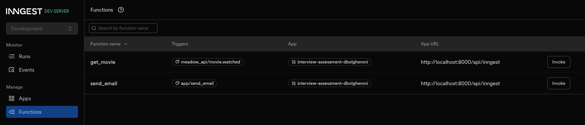
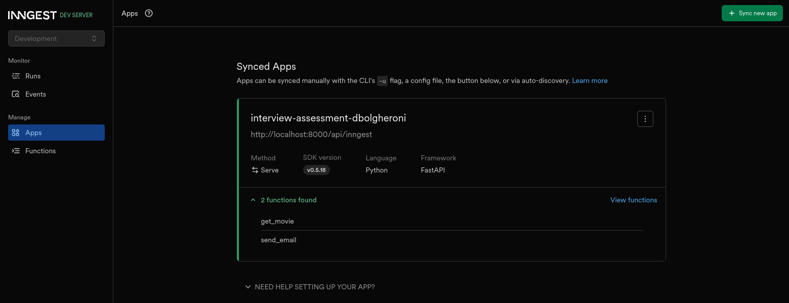
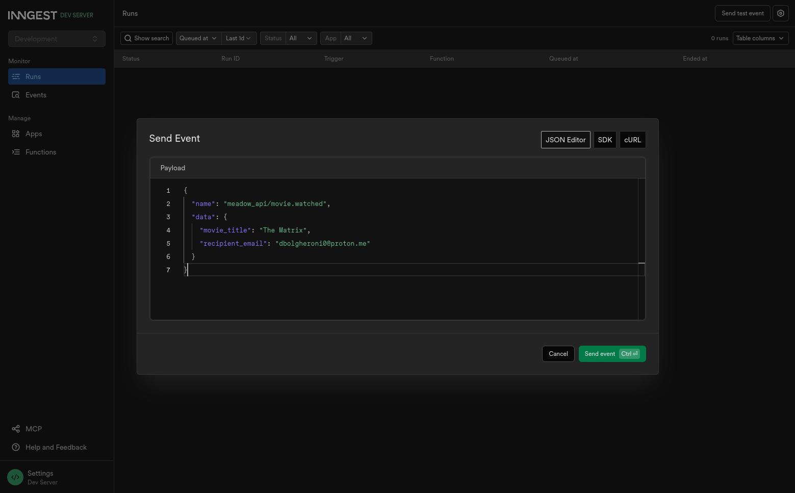
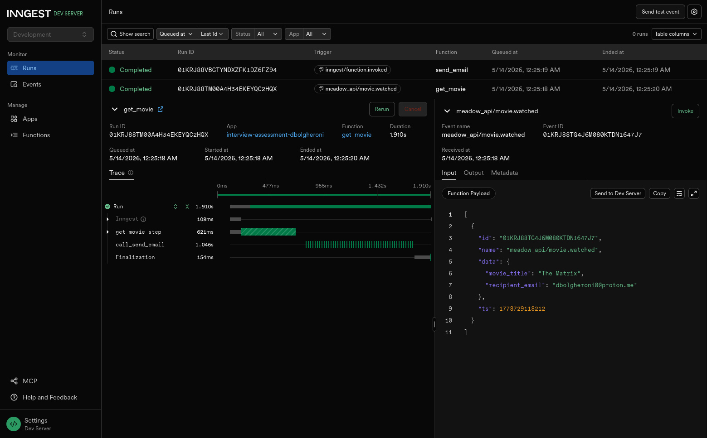
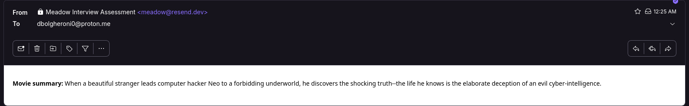
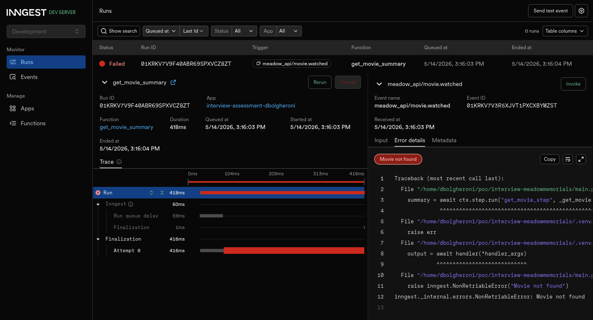

# Meadon Interview Assessment

The project uses `uv` as the Python package and project manager.

To initialize:
```
$ git clone dbolgheroni/meadow-interview-assessment
$ uv sync
```

The project reads the API keys from `.env` files and should search for the following keys:

- `OMDB_API_KEY`
- `RESEND_API_KEY`

## Run instructions

To run locally, a local Inngest server is needed:
```
npx --ignore-scripts=false inngest-cli@latest dev -u http://127.0.0.1:8000/api/inngest --no-discovery
```
It needs to have *npx* installed.

To run the app with `uv`:
```
(INNGEST_DEV=1 uv run uvicorn main:app --reload)
```

## Implmentation Details

The project uses `httpx` for making API calls, which uses an API compatible with `requests` but also support async calls.

The project uses Resend SDK to send emails, as per the task description, and uses the Python SDK instead of the Resend API. Using SDK instead of API speed up the development and can help in case of changes in the API.

There are two Inngest functions: `get_movie_summary` and `send_email_summary`.

Each function has an unique step. `get_movie_summary` is triggered by an event called `meadow_api/movie.watched`, such as this example:

```
{
  "name": "meadow_api/movie.watched",
  "data": {
    "movie_title": "The Matrix",
    "recipient_email": "peter@test.com"
  }
}
```

Once triggered, `get_movie_summary` will hit OMDb API and extract the summary from the movie in the event.

The Inngest functions are triggered in many different ways, but in this project, `get_movie_summary` is triggered externally using the UI (can be also triggered by Python code), and the function `send_email_summary` is triggered by `get_movie_summary`.

Once the summary is extracted, `send_email_summary` is called, chaining the first call with the second call. This pattern follows a pattern similar to Celery chains explained here [here](https://docs.celeryq.dev/en/stable/userguide/canvas.html#chains).

Just keep in mind that Inngest functions are just regular decorated functions in code, can be async, but the concept is different is different than regular functions.

The regular functions being called are nested inside the Inngest functions. This helps keeping the code tight since it's small.

## Error handling

Inngest provide retries by default, configurable by functions and steps. The approach for error handling is using `response.raise_for_status()` and letting the function be retried by Inngest. The number of retries and debouncing is the default set by Inngest.

Resend Python SDK does not go deep into details on how to handle errors, but in case this becomes critical, probably would go down the route of using the Resend API to handle specific errors.

## Changes I would make if starting over

In retrospect, I would probably refactor to unify `get_movie_summary` and `send_email_summary` as a single function, calling both the OMDb API and sending the email as different steps.

The reason for this is because, once I cancel a function, the chained function won't hang doing attempts until it times out.

Doing a parallel with Temporal, it's like keeping a single Workflow to do both things, since they are part of the same "feature".

Temporal has the concept of Child Workflows that can span from the Parent Workflow. This has the advantage that, if the Parent Workflow is cancelled, the Child Workflows are cancelled too. This doesn't happen if a regular Workflow starts another regular Workflow.

Hardcoded email (or any other data) should not be in the code too.

## Other changes I would make when moving to production

I would also remove checking for the API keys in each function and would make sure all the needed keys are checked when the app is initializing. As stated in the code too, I would make sure the keys are not stored in a plain-text `.venv` file but on a proper encrypted vault or secret management library like Bitwarden.

I would also probably use **Pydantic** for input event clean up. Fail earlier instead of checking how the event is structured every time part of the event data is used (in case the event is big instead of a single property like `movie_title`). This is an idea I had when developing, but when I later continued reading the documentation, there is in fact a guide for doing exactly this.

Other changes would include keeping a proper file and dir structure and not everything on the main file of the project. This would include separating the email part on a proper module, and the OMDb part on another one.
```
/src
  services/
    omdb.py
    resend.py
  client.py
  ...
```

The reason is simple: it would make easier to "compose" other features with existing Inngest functions. It would conflict with the idea mentioned earlier about having a single function with multiple steps.

However, the regular functions, which are nested/embedded into inngest functions, could be separated and composed either as an inngest function with multiple steps or as multiple functions with a single step on each, the same way it's in the codebase as of now. It's a matter of understanding, if some guidelines are available, if one approach should be used instead of another.

Inngest is very brief on testing documentation, and tests are **not included**, but would make sure tests are included too.

**POST reflection on testing and code structure**: moving the nested functions outside inngest functions would also help on mocking for testing. `inngest.experimental.mocked`, as the name of the module indicates, is still [experimental](https://www.inngest.com/docs/reference/python/guides/testing). This aligns with the discussion at the interview where it was mentioned Python is not a first class citizen for Inngest.

## Screnshots from UI

Inngest Functions:


Apps:


Sending event:


Completed:


Email received:


Failed function. Note the function is not retried. Also note the chained function to send email won't run:

